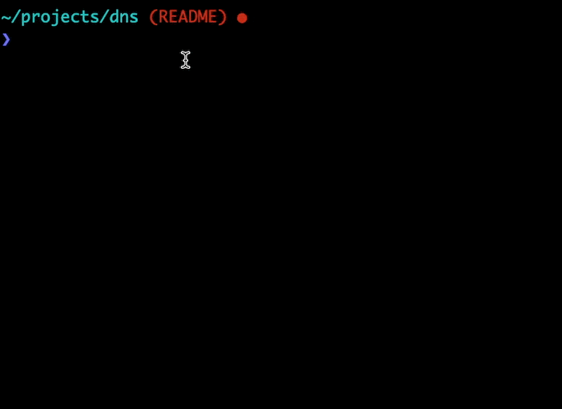

# A Ruby Toy DNS

## What is this, exactly?

This is an implementation of Julia Evans' [Implement DNS in a Weekend](https://implement-dns.wizardzines.com/).

It does more or less what you'd think.

Ask it about a domain, it gives you the IP address, and copies it to your clipboard.

## How do I run it?

Easy (assuming you have Ruby installed)!

Clone the repo, and run `ruby runner.rb`. Then follow the cues!

## Tell me about the directory structure

The code is organized around Julia's pedagogical strategy. She built her DNS server from the ground up, starting with a `query`. Then she showed how to build the `response`, and brought it all together in the `resolver`.

This means that some methods may be redundant across these directories. The bulk of the functional code lives in the `resolver` directory.

## Any interesting revelations along the way?

The thorniest thing for me was figuring out DNS name compression.

When you query a DNS server for a domain name, the response comes back to you as a (mostly) hexadecimal bytestream.

It looks something like this:

`\x81\x80\x00\x01\x00\x01\x00\x00\x00\x00\x03www\x07example\x03com\x00\x00\x01\x00\x01\xc0\x0c\x00\x01\x00\x01\x00\x00R\x9b\x00\x04]\xb8\xd8"`

In the course of reading the bytestream, one of the more important pieces of information is, of course, the domain name. In this case, `www.example.com`.

But the DNS response may need to reference the domain name multiple times. And we don't want to have `www` and `example` and `com` to show up duplicatively in our string. So what do we do?

DNS Compression, of course! (Here's a [link to the relevant spec](https://datatracker.ietf.org/doc/html/rfc1035#section-4.1.4)).

The compression algo goes like this.

1. Read the string until we encounter the hexadecimal figure for a binary number, `11000000`. That's `c0` in hex.
2. That number is a signal -- "we have a compressed item here". The byte _following_ our `11000000` number contains the index for where our domain name shows up in the string. In this case, the following hex number is `0c`, or `12`.
3. That refers us back to the domain name, which we can use in our code.

Here's a little diagram:

Far from the only thing I learned over the course of this project. If you're at all interested in this kind of thing, you should give Julia's project a try!
